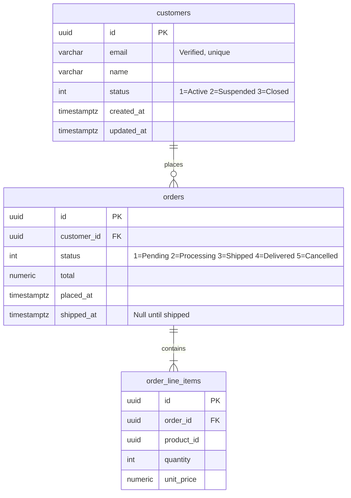

# Database Schema Documentation and Maintenance

The database schema is a first-class project artefact. It is documented in human-readable
form alongside the code, kept in sync with every migration, and reviewed with the same rigour
as any other architectural change.

---

## Schema Documentation Lives in the Repository

Schema documentation is not a wiki page or a shared drive document — it lives in the
repository so it is versioned, reviewed in PRs, and always reflects the current state of
the codebase.

Maintain schema documentation in `docs/schema/README.md` using Mermaid ER diagrams.
Mermaid renders natively in GitHub — no tooling, no CI generation step, visible inline
in PRs and file views.

---

## Use Mermaid for ER Diagrams

Place the diagram in `docs/schema/README.md` so it renders on GitHub without any tooling.

````markdown
## Entity Relationships


````

### Update the diagram in the same PR as the migration

A migration that adds or removes tables, columns, or relationships without a corresponding
diagram update must not be merged. Treat them as a unit.

---

## Document Schema at the Code Level

### XML doc comments on EF Core entities

```csharp
/// <summary>
/// Represents a registered customer account.
/// Closed accounts are retained with <see cref="CustomerStatus.Closed"/> — no soft-delete.
/// </summary>
public sealed class Customer
{
    /// <summary>Surrogate primary key — generated by the database.</summary>
    public Guid Id { get; private set; }

    /// <summary>Verified, unique email address. Maximum 256 characters.</summary>
    public string Email { get; private set; } = string.Empty;

    /// <summary>Display name. Not required to be unique.</summary>
    public string Name { get; private set; } = string.Empty;

    /// <summary>Current lifecycle status of the account.</summary>
    public CustomerStatus Status { get; private set; } = CustomerStatus.Active;
}
```

### Use HasComment() in Fluent API for database-level column comments

Column comments are stored in the database and surfaced by tools like pgAdmin and DBeaver.

```csharp
protected override void OnModelCreating(ModelBuilder modelBuilder)
{
    modelBuilder.Entity<Customer>(entity =>
    {
        entity.ToTable("customers", t => t.HasComment("Registered customer accounts"));

        entity.Property(c => c.Email)
            .HasMaxLength(256)
            .HasComment("Verified, unique email address");

        entity.Property(c => c.Status)
            .HasComment("SmartEnum: 1=Active, 2=Suspended, 3=Closed");
    });
}
```

---

## Migration Naming and Descriptions

### Use descriptive migration names that explain the intent

```bash
# Good — the name describes what and why
dotnet ef migrations add AddOrderShippedAtColumn
dotnet ef migrations add AddCustomerPhoneNumberForSmsNotifications
dotnet ef migrations add IndexOrdersByCustomerIdForPerformance

# Bad — cryptic, date-stamped, or vague
dotnet ef migrations add Update
dotnet ef migrations add Fix
dotnet ef migrations add Migration1
```

### Add a comment block to every migration file

```csharp
/// <summary>
/// Adds the ShippedAt column to the Orders table to record when an order
/// left the warehouse. Nullable because historical orders predate this field.
/// Paired with Mermaid diagram update in docs/schema/README.md.
/// </summary>
public partial class AddOrderShippedAtColumn : Migration
{
    protected override void Up(MigrationBuilder migrationBuilder) { ... }
    protected override void Down(MigrationBuilder migrationBuilder) { ... }
}
```

---

## Significant Schema Changes Require an ADR

Any schema change that is not purely additive (new nullable column, new table) requires an
Architecture Decision Record before implementation:

- Dropping a table or column
- Changing a column type
- Adding a unique or foreign key constraint to existing data
- Introducing or removing a normalisation boundary
- Partitioning or sharding strategy changes

Use the ADR template at `docs/templates/ADR.md`. The ADR must be merged and reviewed before
the migration is written.

---

## Keep an Index Inventory

Document every non-primary-key index in `docs/schema/README.md` alongside the diagram,
and explain why each exists:

```markdown
## Indexes

| Table | Index | Columns | Purpose |
|---|---|---|---|
| orders | ix_orders_customer_id | customer_id | GetOrdersByCustomer — high frequency |
| orders | ix_orders_customer_status | customer_id, status | Filtered order list by status per customer |
| orders | ix_orders_placed_at | placed_at | Date-range reporting queries |
```

An index without a documented query it supports is a candidate for removal.

---

## Schema Drift Detection in CI

Detect drift between the EF Core model and the database using a CI step that applies
migrations to a clean database and checks for any unapplied migrations.

```yaml
# .github/workflows/schema-check.yml
name: Schema Check
on: [pull_request]

jobs:
  schema-drift:
    runs-on: ubuntu-latest
    services:
      postgres:
        image: postgres:16
        env:
          POSTGRES_PASSWORD: test
        options: >-
          --health-cmd pg_isready
          --health-interval 5s
          --health-timeout 5s
          --health-retries 5

    steps:
      - uses: actions/checkout@v4
      - uses: actions/setup-dotnet@v4
        with:
          dotnet-version: '9.0.x'

      - name: Apply migrations to clean database
        run: dotnet ef database update
               --project src/MyApp.Infrastructure
               --startup-project src/MyApp.Api
        env:
          ConnectionStrings__Default: "Host=localhost;Database=myapp_ci;Username=postgres;Password=test"

      - name: Check for pending migrations
        run: |
          PENDING=$(dotnet ef migrations list \
            --project src/MyApp.Infrastructure \
            --startup-project src/MyApp.Api \
            --json | jq '[.[] | select(.applied == false)] | length')
          if [ "$PENDING" -gt 0 ]; then
            echo "There are $PENDING unapplied migrations. Did you forget to add a migration?"
            exit 1
          fi
        env:
          ConnectionStrings__Default: "Host=localhost;Database=myapp_ci;Username=postgres;Password=test"
```

---

## Checklist for Schema-Changing PRs

- [ ] Mermaid ER diagram updated in `docs/schema/README.md`
- [ ] Index inventory updated if indexes were added or removed
- [ ] Migration has a descriptive name and summary comment
- [ ] `HasComment()` added to new tables and columns in Fluent API
- [ ] XML doc comments added or updated on affected entity classes
- [ ] ADR written and merged (for breaking or structural changes)
- [ ] `Down` migration is implemented and tested
- [ ] CI schema drift check passes
